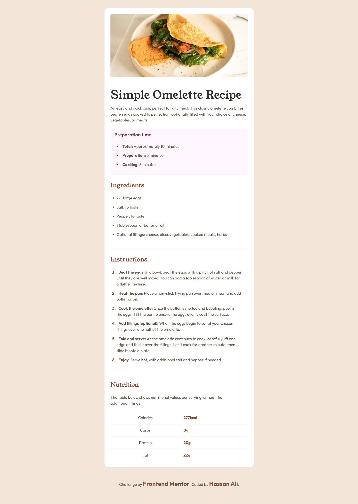
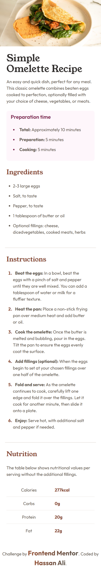

# Frontend Mentor - Recipe page solution

This is my solution to the [Recipe Page Challenge](https://www.frontendmentor.io/challenges/recipe-page-KiTsR8QQKm) on Frontend Mentor.  
Frontend Mentor challenges help you practice building realistic, production-ready web components.

---

## 📌 Overview

### 🔹 The Challenge

Users should be able to:

- View the **recipe page layout** with an image, headings, and sections for preparation, ingredients, and instructions.
- See the design adapt to different screen sizes for mobile and desktop.
- Experience a clean and accessible reading layout.

---

## 🖼️ Screenshots

### Desktop

### Mobile

---

## 🌐 Live Demo

👉 [View Live Demo](https://hassan-ali-byte.github.io/recipe-page-main/)

---

## ⚙️ My Process

### Built With

- ✅ Semantic **HTML5 markup** (`<header>`, `<section>`, `<article>`, `<ul>`, `<li>`, `
`)
- 🎨 **CSS** for layout and styling
- 📐 `max-width` and relative units for responsiveness
- 🟦 **Flexbox/Grid** where needed
- 📱 **Mobile-first workflow**

### 📚 What I Learned

- Practiced styling **tables** (borders, spacing, alignment).
- Customized **`
`** for width, alignment, and thickness.
- Adapted the design without Figma, relying on judgment for spacing.

## 🔗 Resources

- [Josh Comeau – CSS Reset](https://www.joshwcomeau.com/css/custom-css-reset/): Used as the foundation for a consistent and modern base styling across browsers.

## 👨‍💻 Author

**Hassan Ali**

- Frontend Mentor – [@hassan-ali-byte](https://www.frontendmentor.io/profile/hassan-ali-byte)
- GitHub – [hassan-ali-byte](https://github.com/hassan-ali-byte)

---

✨ Thanks for checking out my solution!  
Feedback and suggestions are always welcome 🙌
